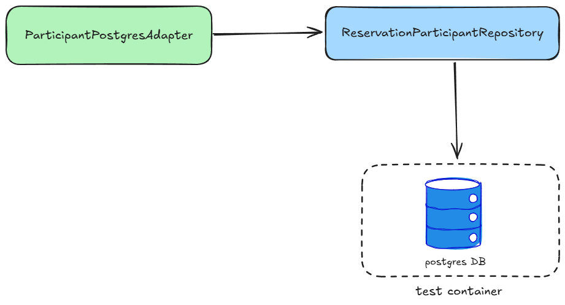
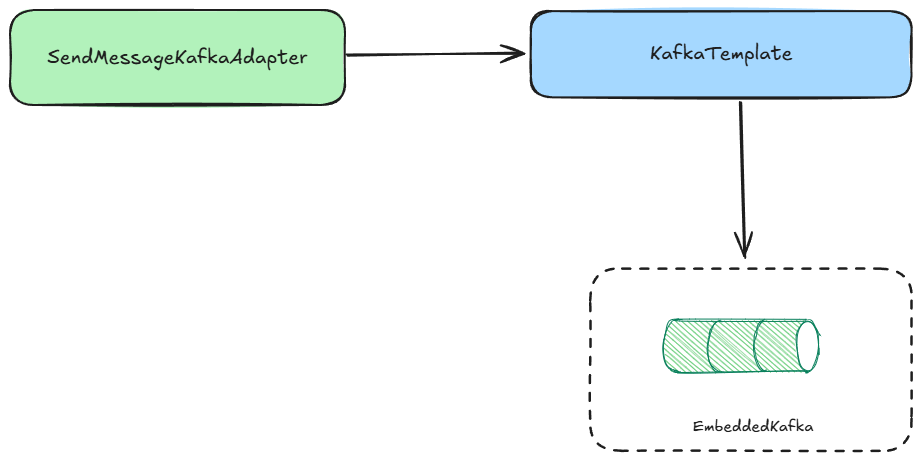

# Integration Tests

## Main goal

The primary goal of integration testing is to verify how an application interacts with external systems. 
For example, is the REST controller properly configured? Does the Kafka listener work as expected? Are the SQL 
queries executed correctly? Integration tests for both incoming and outgoing adapters help provide answers 
to these questions.

## Main concepts

### Test Slices

As integration tests only verify the incoming and outgoing adapters, we don't need to start the entire application 
context—only the classes and configurations required for specific tests. This approach speeds up test execution. 
The Spring Boot framework provides multiple test slice annotations to help achieve this. 
[All available test slices can be found in the documentation.](https://docs.spring.io/spring-boot/appendix/test-auto-configuration/slices.html)

## Outgoing adapters

### Database adapters



Integration tests for database adapters allow us to verify:

- If custom queries are correctly constructed and return the expected results.
- The accuracy of the Hibernate model and its mappings.
- The correctness of database migrations (for example, those performed using Flyway).

It is important to run these tests using the same type of database as is used in production. 
This can be easily achieved with the help of the [Testcontainers library](https://testcontainers.com/), 
which allows spinning up a real database instance (such as PostgreSQL) in a Docker container during test execution.

!!! note "Why not with in-memory db like H2?"

    While it may be tempting to use an in-memory database like H2 for tests because it is easy to set up, 
    this approach can lead to issues as the project grows. Eventually, you may need to use features that are available 
    in your production database but not supported by H2. This can result in inconsistent behavior and the need to add 
    workarounds or separate migrations just for test purposes. Such incompatibilities can lead to tests passing locally 
    but failing in production. In contrast, Testcontainers are also straightforward to configure and run quickly, 
    eliminating the need for H2.  

    However, in-memory databases can be a good option during the early stages of a project when the choice of a 
    production database has not yet been finalized and you want to delay this decision.


Below is an example of an integration test for a database adapter. This test checks whether an entity is correctly 
inserted into the database. The test runs against a real PostgreSQL instance provided by Testcontainers.

```java
class ParticipantPostgresAdapterTestIT extends PostgresTestIT {

    @Autowired private ReservationParticipantRepository repository;

    private ParticipantPostgresAdapter adapter;

    @BeforeEach
    void setup() {
        adapter = new ParticipantPostgresAdapter(repository);
    }

    @Test
    void shouldInsertParticipant() {
        // given
        ReservationParticipant participant = ReservationParticipantTestFactory.create();

        // when
        adapter.insert(participant);

        // then
        StatisticAssertions.assertThat(statistics).hasQueryCount(1).hasInsertCount(1);
        
        ReservationParticipantEntity savedParticipant =
                repository.findByIdentifier(IDENTIFIER).orElseThrow();
        assertThat(savedParticipant.getFirstName()).isEqualTo(FIRST_NAME);
        assertThat(savedParticipant.getSurname()).isEqualTo(SURNAME);
    }
}
```

And `PostgresTestIT` which is a template from postgres database adapters tests.

```java
@DataJpaTest
@AutoConfigureTestDatabase(replace = AutoConfigureTestDatabase.Replace.NONE)
abstract class PostgresTestIT {
    
    protected static final PostgreSQLContainer<?> postgreSQLContainer =
            new PostgreSQLContainer<>(DockerImageName.parse("postgres:latest"));

    static {
        postgreSQLContainer.start();
    }

    @DynamicPropertySource
    static void registerProperties(DynamicPropertyRegistry registry) {
        registry.add("spring.datasource.url", postgreSQLContainer::getJdbcUrl);
        registry.add("spring.datasource.username", postgreSQLContainer::getUsername);
        registry.add("spring.datasource.password", postgreSQLContainer::getPassword);
    }

    @Autowired private SessionFactory sessionFactory;

    protected Statistics statistics;

    @BeforeEach
    void enableStatistics() {
        statistics = sessionFactory.getStatistics();
        statistics.clear();
        statistics.setStatisticsEnabled(true);
    }
}
```

This test also verifies Hibernate statistics to ensure that the entity is mapped and managed efficiently. 
Monitoring these statistics helps detect issues such as the [N+1 query problem](https://vladmihalcea.com/n-plus-1-query-problem/)
or other problems related to Hibernate entity configuration.

!!! note "Why data are not cleaned up after the test?"

    Since `@DataJpaTest` ensures that the entire test runs within a single transaction, all changes made during 
    the test are rolled back after the test completes. Therefore, manual cleanup is not necessary.

    However, in some cases, this behavior of `@DataJpaTest` may not be desirable. To disable transactional behavior 
    for a specific test, you can use the annotation `@Transactional(propagation = Propagation.NOT_SUPPORTED)` to 
    suspend the transaction created by the `@DataJpaTest` annotation.

### AMQP adapters



Integration tests for AMQP adapters ensure that messages are correctly sent to message brokers, such as Kafka or RabbitMQ.

!!! warning "Is it worth performing such tests?"

    If the message-sending logic is straightforward, these integration tests can often be omitted; verification is then 
    typically covered with module or unit tests.  
    However, if the logic includes more complex scenarios or multiple conditions, integration 
    tests become valuable to ensure that the adapter interacts with the broker as intended.

Integration testing of a Kafka-based AMQP adapter is exemplified below:

```java
class SendMessageKafkaAdapterTestIT extends KafkaTestIT {

    private SendMessageKafkaAdapter adapter;

    @BeforeEach
    void setup() {
        adapter = new SendMessageKafkaAdapter(template, objectMapper);
    }

    @Test
    void shouldSendMessage(EmbeddedKafkaBroker embeddedKafkaBroker) {
        // given
        Room room = new Room(new RoomIdentifier("178caccd-d9cd-4e35-886d-2fc6e19f8ed5"), 5);
        Reservation reservation = createReservation(room);
        room.reserve(reservation);

        // when
        adapter.send(room, reservation);

        // then
        String messageContent = getMessageFromTopic(embeddedKafkaBroker, "roomReserved");
        JsonAssert.comparator(JsonCompareMode.STRICT)
                .assertIsMatch(
                        """
                                {
                                    "roomIdentifier":"178caccd-d9cd-4e35-886d-2fc6e19f8ed5",
                                    "reservationIdentifier":"14c9caff-cdae-46b9-9448-86fa2ee7bfd1",
                                    "startTime":[2025,6,23,10,0],
                                    "endTime":[2025,6,23,12,0]
                                }
                                """,
                        messageContent);
    }
}
```

abstract base class for Kafka Integration tests:

```java
@EmbeddedKafka(kraft = true)
abstract class KafkaTestIT {

  protected final ObjectMapper objectMapper = createObjectMapper();

  private final KafkaConfiguration kafkaConfiguration = new KafkaConfiguration();

  protected KafkaTemplate<String, String> template;

  @BeforeEach
  void prepareKafkaTemplate(EmbeddedKafkaBroker embeddedKafkaBroker) {
    embeddedKafkaBroker.addTopics(kafkaConfiguration.roomReservedTopic());

    Map<String, Object> producerProps = KafkaTestUtils.producerProps(embeddedKafkaBroker);
    ProducerFactory<String, String> producerFactory =
        new DefaultKafkaProducerFactory<>(producerProps);
    template = new KafkaTemplate<>(producerFactory);
  }

  protected String getMessageFromTopic(EmbeddedKafkaBroker embeddedKafkaBroker, String topic) {
    Map<String, Object> consumerProps =
        KafkaTestUtils.consumerProps("testT", "false", embeddedKafkaBroker);
    DefaultKafkaConsumerFactory<String, String> cf =
        new DefaultKafkaConsumerFactory<>(consumerProps);
    Consumer<String, String> consumer = cf.createConsumer();
    embeddedKafkaBroker.consumeFromAnEmbeddedTopic(consumer, topic);

    return KafkaTestUtils.getSingleRecord(consumer, topic).value();
  }

  private static ObjectMapper createObjectMapper() {
    ObjectMapper objectMapper = new ObjectMapper();
    objectMapper.registerModule(new JavaTimeModule());
    objectMapper.registerModule(new Jdk8Module());
    return objectMapper;
  }
}
```

This test uses the `@EmbeddedKafka` annotation provided by Spring Boot
([documentation](https://docs.spring.io/spring-kafka/reference/testing.html#example)).
This approach is suitable for verifying message publication without requiring access to a real broker.

**Considerations**:

- **Configuration Duplication** - One drawback to using `@EmbeddedKafka` is the requirement to manually configure topics 
    and Kafka-related beans in the test context. The test environment does not automatically inherit configuration from the production code.
- **Alternative: Testcontainers** - As an alternative to `@EmbeddedKafka`, [Testcontainers](https://www.testcontainers.org/modules/kafka/) 
    may be used to spin up a real Kafka broker in a Docker container. This approach more closely replicates 
    production conditions.
- **Test Scope:** - When leveraging Testcontainers, there is a choice between starting the entire Spring context 
    (which may negatively impact test performance) and initializing only the necessary beans or configurations required 
    for AMQP integration testing.