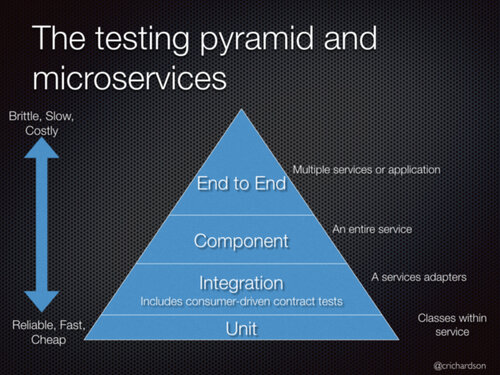

# Test Pyramid

## Composition of the Test Pyramid

<figure markdown="span">
    
    <figcaption>Test Pyramid by [Chris Richardson, microservices.io](https://microservices.io/microservices/testing/2019/09/20/oracle-code-one-testing.html)</figcaption>
</figure>

The test pyramid is a concept in software testing that illustrates the types of tests and the recommended proportion of each in a well-tested application. The lower you go in the pyramid, the faster and cheaper the tests become, so there should be more of them. As you move higher in the pyramid, the tests become slower, more expensive, and more brittle; there should therefore be fewer of these.

The base of the pyramid consists of [unit tests](../unit/unit_tests.md), which are fast, inexpensive to write, and stable. The majority of business logic should be covered by these tests. Unit tests give a short feedback loop, allowing developers to quickly identify and fix issues.

The next layer are integration tests. These tests check how the application interacts with external systems such as databases, message brokers, or other services (contract tests). Integration tests are slower and more expensive to set up than unit tests.

In the middle of the pyramid are component tests. These verify end-to-end use cases within the application, typically starting from incoming adapters, passing through business logic, and ending with outgoing adapters. Component tests are relatively slow, more expensive to write than integration tests, and more brittle. They mainly focus on validating happy paths.

At the top of the pyramid are end-to-end tests. These assess the application from the reservationParticipant's perspective, making them very slow, costly to write, and highly brittle. End-to-end tests should be reserved for business-critical scenarios and executed only in production-like environments. They can be conducted via the user interface or the API. While UI-based tests closely mimic the reservationParticipant experience and can reveal problems missed by other types of tests, they are typically more brittle due to frequent UI changes.

## Why is the Test Pyramid Important?

The test pyramid is critical because it enables teams to maximize the value and efficiency of their testing strategy. By following the pyramid’s structure and maintaining the right proportion of test types, you gain several key benefits:

- **Cost Efficiency:** Automated tests, especially at the lower levels (unit and integration), are fast to execute and inexpensive to maintain, reducing the overall cost of quality assurance efforts.
- **Higher Team Velocity:** A strong foundation of fast and reliable tests provides rapid feedback, allowing the team to develop and release features more quickly and with greater confidence.
- **Fewer Bugs in Production:** Well-structured test coverage across all application layers helps catch issues early, reducing the likelihood of defects reaching users.
- **Living Documentation:** Tests can serve as precise documentation of expected application behavior and requirements, making the codebase easier to understand for current and future team members.
- **Test Stability:** By emphasizing lower-level tests, which tend to be more stable and less brittle, you minimize flaky test failures and maintenance overhead.
- **Confidence in Refactoring:** With comprehensive automated tests in place, engineers can refactor code more bravely, knowing regressions will be caught quickly.

In contrast, imbalanced test suites—often visualized by antipatterns like the [test ice-cream cone](https://bugbug.io/blog/software-testing/ice-cream-cone-anti-pattern/)—lead to unstable, slow, and expensive testing. Adhering to the test pyramid helps teams build higher-quality software while keeping development efficient and sustainable.

## References

- [Microservices Patterns](https://microservices.io/book)
- [The Practical Test Pyramid](https://martinfowler.com/articles/practical-test-pyramid.html)