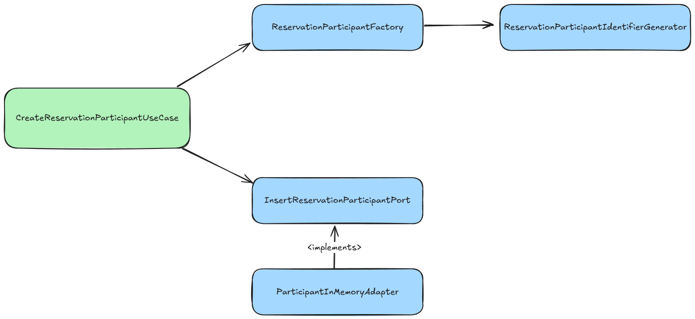

# Types of unit tests

Unit tests form the foundation of the testing pyramid. They should constitute the majority of the tests in a project, as
they are designed to be fast, stable, and inexpensive to run.

## Solitary unit tests

Solitary unit tests—also known as the mockist style - rely on mocking every dependency. The idea is to isolate the unit
under test from its collaborators.

**Advantages**:

- **Isolation:** It is sometimes easier to mock a dependency and treat it as a black box.
- **Easy to create:** Easy to create but not always. For some classes like mappers it is hard to mock it.

**Disadvantages**:

- **Maintenance overhead:** Changing the code structure (e.g., refactoring) can break tests, increasing maintenance
  efforts.
- **Mismatch risk:** The mocked behavior might differ from real behavior, potentially hiding integration issues.
- **Test proliferation:** More tests are needed—often one per class—to cover all behaviors.
- **Mock not fit to every type of class:** Mocking some classes like mappers does not make sense, as logic of mapping
  would be repeated in tests.

## Sociable unit tests

Sociable unit tests, sometimes referred to as the classicist style, do not rely on mocking dependencies. Instead, they
use real implementations for components, or lightweight in-memory substitutes for external systems like databases. These
tests are typically written against the public API of a module or a group of classes within a package.

**Advantages**:

- **Realism:** Tests are more realistic as they use actual implementations, revealing issues that might only surface in
  integrated environments.
- **Robustness:** Because they follow production-like interactions, changes in the internal code structure are less
  likely to break the tests. Only changes in the public API will cause test failures. Every other change that does not
  affect on a result of the method will not break the test.
- **API-driven:** Testing is centered around the public interface, which better reflects how the module is used.
- **Reduced number of tests:** Focusing on modules or groups of classes typically means fewer tests need to be
  maintained.
- **BDD:** Tests can be written in a behavior-driven development (BDD) style, making them more readable and
  understandable.

**Disadvantages**:

- **Complex setup:** Dependencies might have their own dependencies, resulting in complex configuration for the test
  environment.
- **In-memory limitations:** Creating in-memory implementations (for instance, for databases) can add overhead and may
  not perfectly replicate real-world behavior. Also, any changes in real database adapters will be need to be reflected
  in in-memory implementations.

## When to use which style?

As is often said in IT, it depends. Due to its flexibility, sociable unit tests fit most scenarios. However, there are
situations where solitary unit tests are more appropriate. In some cases, a mixed style can be employed—some
dependencies can be mocked while others use real implementations.

A great talk by Sandro Mancuso on this topic is available
here: [Does TDD Really Lead to Good Design? (Sandro Mancuso)](https://youtu.be/KyFVA4Spcgg?si=S5eOo9rR9g4rYP_e).

### When to use a mock and when to use a real implementation?

Here are some questions to help you decide whether to mock a dependency or use a real implementation:

1. **Does the dependency belong to the class under test?**
    - If yes, use the real implementation. For example, strategies in the Strategy pattern belong solely to their client
      class, making mocking unnecessary.
    - If not, mock it. Dependencies shared among multiple classes are better mocked. However, there are exceptions to
      this rule, such as utility classes, which should have their own tests but also should not be mocked in the unit
      under test.

2. **Is the dependency a Domain-Driven Design (DDD) aggregate?**
    - Aggregates typically shouldn’t be mocked.

3. **Will mocking the dependency require replicating logic?**
    - For example, mocking mappers often involves replicating mapping logic in tests. In such cases, use a real
      implementation. If a mapper is complex and depends on other services that require mocking, re-evaluate its design.
      Ideally, mappers should remain simple.

4. **Does the dependency perform side effects?**
    - Database operations, REST API calls, or AMQP communication should not be part of unit tests; these are better
      suited for integration tests. In unit tests, mocks can be used, but in-memory implementations should also be
      considered. For example, database repositories can have their own in-memory test implementations instead of being
      mocked. This approach can significantly simplify tests. For operations like "fire and forget" messaging, simple
      mocks can be used without any negative impact.

# What is not worth to unit test

- **Adapters for External Systems:**  
  Components that interface with external services such as databases, HTTP APIs, or messaging systems should be tested
  through integration tests. These tests validate the communication with the real system or a close substitute.
- **Configuration Classes:**  
  These classes usually contain no business logic. Integration often verifies their correctness or end-to-end
  tests where the actual configuration is used.
- **Simple Getters and Setters:**  
  If these methods do nothing more than return or set a value, writing unit tests for them might not be worthwhile,
  unless additional logic is present.

# References

https://martinfowler.com/bliki/UnitTest.html

[Improving your Test Driven Development in 45 minutes - Jakub Nabrdalik](https://www.youtube.com/watch?v=2vEoL3Irgiw)

[Does TDD Really Lead to Good Design? (Sandro Mancuso)](https://youtu.be/KyFVA4Spcgg?si=S5eOo9rR9g4rYP_e)